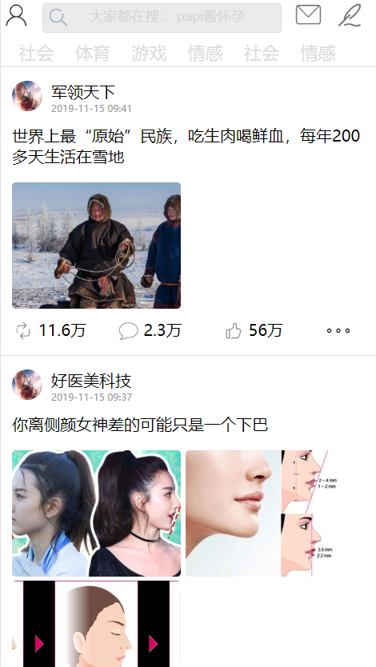
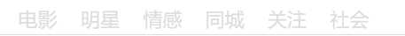

# StarStudio
工作室的任务

### 第一次任务
- 背景图片怎么设置才合适
- 背景图片怎么设置阴影（filter?)
### 第二次移动端任务
- 整体效果

- 整体都用的`grid`布局
- 搜索框热搜来自自己模拟的数据，每刷新一次都会获得新的热搜

- 导航栏也使用的模拟数据

- 微博也是使用的模拟数据
- 前一段时间看了vue框架，这是第一次正式的实验，现在在看ES6(对象扩展)+图解HTTP(首部字段)+CSS权威指南(字体样式)